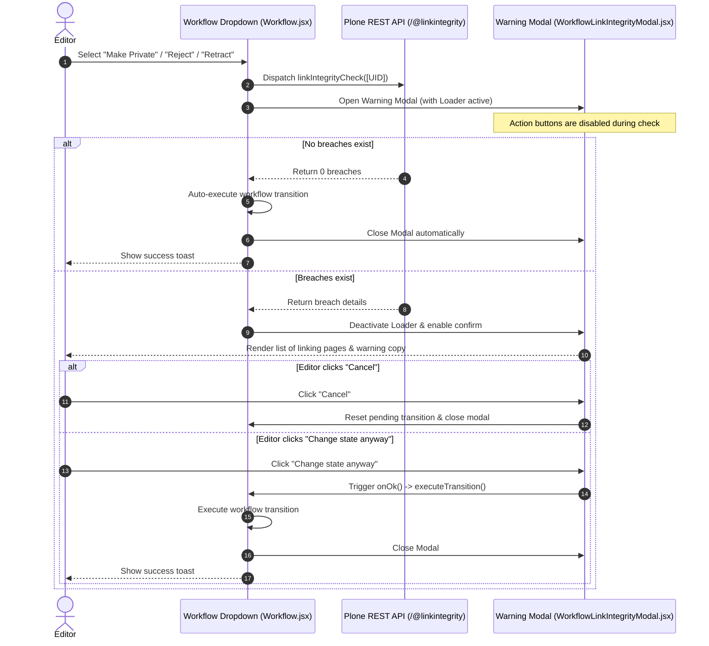

# Link Integrity Workflow warning Specification

## Overview

To prevent breaking the browsing experience of public (anonymous) website visitors, Climate-ADAPT intercepts workflow transitions that limit content visibility (such as changing a state to **Private**, **Reject**, or **Retract**). 

Before finalizing these transitions, the system performs an asynchronous backend check using the Plone link integrity relation catalog (`@linkintegrity`) to discover if any other published pages link to the target item. If referencing items are found, the user is presented with a warning modal detailing the pages that link to the item, allowing them to either cancel or proceed anyway.

---

## Architectural Workflow

---

## Implementation Details

### 1. Workflow Interception (Customization)
*   **Path**: [Workflow.jsx](file:///home/tibi/work/eea.docker.plone-climateadapt/cca/frontend/src/addons/volto-cca-policy/src/customizations/volto/components/manage/Workflow/Workflow.jsx)
*   **Role**: Shadows Volto core's workflow select component. Intercepts transitions containing state keys (`private`, `reject`, `retract`) or URL suffixes (`/reject`, `/retract`). Dispatches `linkIntegrityCheck` and manages `pendingOption` state. Executes transition automatically if 0 breaches are found.

### 2. Warning Modal Component
*   **Path**: [WorkflowLinkIntegrityModal.jsx](file:///home/tibi/work/eea.docker.plone-climateadapt/cca/frontend/src/addons/volto-cca-policy/src/components/manage/Workflow/WorkflowLinkIntegrityModal.jsx)
*   **Role**: A custom `semantic-ui-react` `Confirm` component wrapper. Utilizes a unified and stable component template to ensure reliable event loop listener binding.
*   **Key UX Features**:
    *   Maintains button state `disabled: loading` during ongoing checks to prevent premature actions.
    *   Renders an active `Loader` and `Dimmer` during loading.
    *   Displays the exact list of referencing (source) items and target sub-items.
    *   Displays the warning copy: 
        > *"By changing the state, we're not breaking references, but may break user experience for final Anonymous users. There are {brokenReferences} {variation} to this item:"*

### 3. Unit Verification Suite
*   **Path**: [WorkflowLinkIntegrityModal.test.jsx](file:///home/tibi/work/eea.docker.plone-climateadapt/cca/frontend/src/addons/volto-cca-policy/src/components/manage/Workflow/WorkflowLinkIntegrityModal.test.jsx)
*   **Role**: Houses Jest/React Testing Library assertions verifying loading indicator visibility, auto-proceed behavior with 0 breaches, warnings list aggregation for multiple breaches, and confirm button presence.
